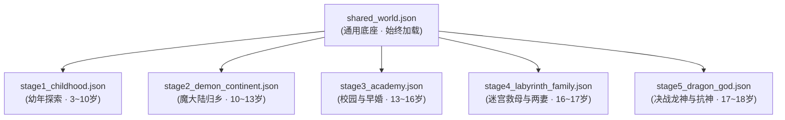

# 《无职转生》时间线分阶段世界书（Lorebook）项目

本项目是针对日本轻小说《无职转生 ～到了异世界就拿出真本事～》（理不尽な孙の手 著）第 1~15 卷构建的**面向大语言模型角色扮演（Roleplay / RP）与推演的专业级分阶段防剧透世界书（Lorebook）**。

> [!IMPORTANT]
> **版权与内容合规声明**：
> 本仓库**不包含任何小说原文正文、章节切分、提取草稿或电子书原文件**（`inputs/` 与 `outputs/` 目录均已被 `.gitignore` 严格完全忽略，仅在本地提取时作为临时数据流）。
> 仓库核心交付物仅为**基于原著提炼沉淀的原创结构化设定字典（JSON Lorebook）与总览索引**。

---

## 一、世界书核心特色与规范

1. **分阶段防剧透切片（Stage Slicing）**：
   - 彻底打破传统世界书“单一静态全剧透条目”的缺陷，针对角色随剧情剧烈变化（如：从幼年神童、狂犬剑客、ED低谷、魔法大学新婚、迷宫断臂，到魔导铠决战龙神）在不同阶段独立拆条。
   - RP 运行推演时严格按当前扮演时期加载对应阶段文件，彻底杜绝超前剧透与时间线穿帮。
2. **纯粹硬核客观设定（Grounding & Anti-Hallucination）**：
   - 基于原著全部 201 章节严密考据与反转甄别，清晰区分“角色主观误解”与“客观世界真相”。
3. **字数与元数据硬约束**：
   - **内容字数约束**：每个条目的核心设定（`content`）均严格校验在 **50~150 汉字**以内，去除冗余修饰，确保大模型上下文高效利用。
   - **触发词穷举**：每个条目的 `keywords` 包含角色/地点的本名、别名、旧称、他人称呼及常见代称，确保在各种交互场景下稳定触发。

---

## 二、世界书阶段划分与条目统计

整个世界书体系由 **1 个通用常驻底座 + 5 个历史阶段** 组成，共计 **158 条** 精准设定条目：

| 阶段文件 | 阶段名称 | 对应卷数 | 核心角色年龄 | 核心/次要条目 | 总条目数 | 阶段剧情切片与防剧透状态 |
|:---|:---|:---:|:---:|:---:|:---:|:---|
| [`shared_world.json`](world_stages/shared_world.json) | 跨阶段通用底座 | 全卷通用 | 全时期常驻 | 18 核心 / 8 次要 | **26 条** | 全阶魔术、剑术体系、斗气、列强石碑、神子咒子、魔眼、六面世界宇宙观、吸魔石、神刀名器魔剑等底层规则，**始终加载**。 |
| [`stage1_childhood.json`](world_stages/stage1_childhood.json) | 幼年篇 | 卷 01~02 | 3~10 岁 | 12 核心 / 4 次要 | **16 条** | 布耶纳村启蒙、师尊洛琪希、幼年希露菲、狂犬艾莉丝、保罗与塞妮丝，至大转移爆发前夕。 |
| [`stage2_demon_continent.json`](world_stages/stage2_demon_continent.json) | 魔大陆与长征篇 | 卷 03~06 | 10~13 岁 | 26 核心 / 10 次要 | **36 条** | Dead End 三人组、魔大陆流亡、大森林与米里斯神圣国、初战龙神贯穿胸口、艾莉丝不辞而别。 |
| [`stage3_academy.json`](world_stages/stage3_academy.json) | 青少年·魔法大学篇 | 卷 07~11 | 13~16 岁 | 23 核心 / 8 次要 | **31 条** | 泥沼独行冒险者、莎拉心结、魔法大学入学、七星与札诺巴、菲兹身份揭露与 ED 治愈、希露菲新婚与转折点三。**（保罗仍在世，洛琪希仍在沙漠）** |
| [`stage4_labyrinth_family.json`](world_stages/stage4_labyrinth_family.json) | 迷宫救援与两妻篇 | 卷 12~13 | 16~17 岁 | 21 核心 / 3 次要 | **24 条** | 贝卡利特转移迷宫死斗、魔石九头龙、保罗阵亡与塞妮丝救出（失智）、鲁迪断臂与札里夫义手、纳洛琪希为第二妻、长女露西诞生。**（人神伪装仍未破）** |
| [`stage5_dragon_god.json`](world_stages/stage5_dragon_god.json) | 空中要塞与决战龙神篇 | 卷 14~15 | 17~18 岁 | 21 核心 / 4 次要 | **25 条** | 佩尔基乌斯空中要塞、七星干涸病救治、**转折点四老鲁迪时空日记彻底揭穿人神**、研制魔导铠一式决战龙神、狂剑王艾莉丝归位完婚、**鲁迪宣誓归顺龙神**。 |
| **全体系总计** | - | **全 15 卷** | - | **119 核心 / 39 次要** | **158 条** | 完整索引可查阅 [`world_stages/world_summary.md`](world_stages/world_summary.md) |

---

## 三、目录结构说明

```
MushokuTensei/
├── .gitignore                      # Git 忽略配置（忽略原文正文、二进制 EPUB、环境与缓存）
├── README.md                       # 项目总体说明与使用指南
├── convert_all.py                  # 本地 EPUB 批量转 Markdown 入口包装脚本
│
├── world_stages/                   # 【核心交付资产】分阶段 RP 世界书正式发布目录
│   ├── shared_world.json           # 跨阶段通用底座（26 条）
│   ├── stage1_childhood.json       # 阶段一：幼年篇（16 条）
│   ├── stage2_demon_continent.json # 阶段二：魔大陆长征篇（36 条）
│   ├── stage3_academy.json         # 阶段三：魔法大学与早婚篇（31 条）
│   ├── stage4_labyrinth_family.json# 阶段四：迷宫救援与两妻篇（24 条）
│   ├── stage5_dragon_god.json      # 阶段五：空中要塞与决战龙神篇（25 条）
│   └── world_summary.md            # 人类可读的世界书条目总览与索引
│
├── prompt/                         # 规范规约文档（标准提取与合并提示词设计）
│   ├── 00_tool_create.md           # 章节切分与正文提取规约
│   ├── 01_world_extract.md         # 逐章原生世界设定提取标准
│   ├── 02_world_merge.md           # 分阶段世界书归并与格式规范
│   ├── 03_character_data.md        # 目标角色语料提取规约
│   ├── 04_character_card.md        # 角色卡生成与 Tavern 适配规约
│   └── template/                   # 通用 IP 知识工程与分阶段角色卡流水线模板库
│
├── tools/                          # 本地开发与数据流水线脚本
│   ├── convert_all.py              # EPUB 深度解析与清洗导出引擎
│   ├── vol15_diary_data.py         # 第 15 卷老鲁迪日记插图文字还原辅助数据
│   └── build_final_stages.py       # 世界书分阶段自动化构建与 50~150 字约束校验引擎
│
├── inputs/                         # [本地工作目录 · Git 忽略] 原始图书存放处
└── outputs/                        # [本地工作目录 · Git 忽略] 本地生成的中间正文与提取草稿
    ├── chapters/                   # 本地切章产物（不进入仓库）
    └── world_raw/                  # 本地逐章提取草稿（不进入仓库）
```

---

## 四、在角色扮演（RP）与 AI Agent 中的挂载规范

在进行基于时间线的大模型角色扮演（如 SillyTavern、Dify、LangChain、Claude/GPT 对话系统）时，为杜绝时间线串味与超前剧透，**严禁一次性加载所有阶段**。

请严格采用 **“1 个通用底座 + 1 个阶段文件”** 的双文件挂载规则：



- **推演幼年乡村生活**：加载 `shared_world.json` + `stage1_childhood.json`。
- **推演魔大陆死胡同冒险**：加载 `shared_world.json` + `stage2_demon_continent.json`。
- **推演魔法大学校园与早婚恋爱**：加载 `shared_world.json` + `stage3_academy.json`（此时保罗健康在贝卡利特，艾莉丝在圣地苦修）。
- **推演迷宫救援与两妻家庭日常**：加载 `shared_world.json` + `stage4_labyrinth_family.json`（保罗战死，鲁迪装义肢，洛琪希进门，露西出生，尚未知晓人神阴谋）。
- **推演决战龙神与反神史诗**：加载 `shared_world.json` + `stage5_dragon_god.json`（人神真面目暴露，魔导铠参战，艾莉丝归位，鲁迪成为龙神右腕）。

---

## 五、构建与校验脚本

若对条目设定或关键词进行了扩展调整，可通过以下命令重新校验并生成所有发布阶段世界书：
```bash
python tools/build_final_stages.py
```
> **自动合规检查**：脚本将自动验证每个 JSON 条目的必备字段，并确保每个条目的 `content` 纯文本严格落在 **50 ~ 150 汉字** 区间之内。
