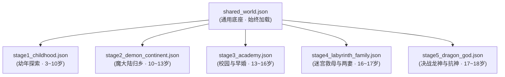

# 《无职转生》语料提取与时间线分阶段世界书构建项目

本项目致力于对日本轻小说《无职转生 ～到了异世界就拿出真本事～》（理不尽な孙の手 著）第 1~15 卷进行高精度的文本清洗切分、逐章原生世界设定提取，并构建面向大模型角色扮演（Roleplay / RP）与推演的**全时间线防剧透世界书体系**。

---

## 一、项目核心亮点

1. **201 章全量清洗与插图文本还原**：
   - 实现了对 15 本原始 EPUB 的脊骨（Spine）遍历、NCX 标题精准对齐、段落与杂质清洗。
   - 针对第 15 卷中极为关键的插图文字（老鲁迪未来日记第 1~20 页内容：魔石病惨案、自动人偶、艾莉丝之死、六面世界真相），完整识别并自动回填至正文对应位置。
2. **201 份逐章独立原生设定库（`outputs/world_raw/`）**：
   - 严格遵循 `prompt/01_world_extract.md` 标准，纯客观事实提取，**每条设定附带逐字原文依据（`原文依据："……"`）**。
   - 彻底区分“角色主观认知”与“客观事实真相”，不确定信息统一标注 `[存疑]`，实现 100% 零脑补、零超前跨卷剧透。
3. **分阶段防剧透世界书体系（`world_stages/`）**：
   - 遵循 `prompt/02_world_merge.md` 规范，同一实体在不同时期严格按时间线切片拆条。
   - **字数硬约束**：每个条目的设定描述（`content`）均经过脚本严格校验在 **50~150 汉字**以内，剔除修饰语句，保留高密度硬核设定。
   - **元数据完备**：包含 `keywords`（穷举本名/别名/外号/触发词）、`timeline`、`priority`（核心/次要）、`category`、`reveal_arc`、`spoiler`、`source_chapters` 等字段。

---

## 二、世界书阶段划分与条目统计

整个世界书体系由 **1 个通用常驻底座 + 5 个历史阶段** 组成，共计 **158 条** 精准设定条目：

| 阶段文件 | 阶段名称 | 对应卷数 | 核心角色年龄 | 核心/次要条目 | 总条目数 | 阶段剧情切片与防剧透状态 |
|:---|:---|:---:|:---:|:---:|:---:|:---|
| [`shared_world.json`](world_stages/shared_world.json) | 跨阶段通用底座 | 全卷通用 | 全时期常驻 | 18 核心 / 8 次要 | **26 条** | 全阶魔术、剑术体系、斗气、列强石碑、神子咒子、魔眼、六面世界宇宙观、吸魔石、神刀名器魔剑等底层规则，**始终加载**。 |
| [`stage1_childhood.json`](world_stages/stage1_childhood.json) | 幼年篇 | 卷 01~02 | 3~10 岁 | 12 核心 / 4 次要 | **16 条** | 布耶纳村启蒙、师尊洛琪希、幼年希露菲、狂犬艾莉丝、保罗与塞妮丝，至大转移爆发前夕。 |
| [`stage2_demon_continent.json`](world_stages/stage2_demon_continent.json) | 魔大陆与长征篇 | 卷 03~06 | 10~13 岁 | 26 核心 / 10 次要 | **36 条** | Dead End 三人组、魔大陆流亡、大森林与米里斯神圣国、初战龙神贯穿胸口、艾莉丝不辞而别。 |
| [`stage3_academy.json`](world_stages/stage3_academy.json) | 青少年·魔法大学篇 | 卷 07~11 | 13~16 岁 | 23 核心 / 8 次要 | **31 条** | 泥沼独行冒险者、莎拉心结、魔法大学入学、七星与札诺巴、菲兹身份揭露与 ED 治愈、希露菲新婚与转折点三。**（保罗仍在世，洛琪希仍在沙漠）** |
| [`stage4_labyrinth_family.json`](world_stages/stage4_labyrinth_family.json) | 迷宫救援与两妻篇 | 卷 12~13 | 16~17 岁 | 21 核心 / 3 次要 | **24 条** | 贝卡利特转移迷宫死斗、魔石九头龙、保罗阵亡与塞妮丝救出（失智）、鲁迪断臂与札里夫义手、纳洛琪希为第二妻、长女露西诞生。**（人神伪装仍未破）** |
| [`stage5_dragon_god.json`](world_stages/stage5_dragon_god.json) | 空中要塞与决战龙神篇 | 卷 14~15 | 17~18 岁 | 21 核心 / 4 次要 | **25 条** | 佩尔基乌斯空中要塞、七星干涸病救治、**转折点四老鲁迪时空日记彻底揭穿人神**、研制魔导铠一式决战龙神、狂剑王艾莉丝归位完婚、**鲁迪宣誓归顺龙神**。 |
| **全体系总计** | - | **全 15 卷** | - | **119 核心 / 39 次要** | **158 条** | 完整索引可查阅 [`world_stages/world_summary.md`](world_stages/world_summary.md) |

---

## 三、目录结构说明

```
MushokuTensei/
├── .gitignore                      # Git 忽略配置（忽略虚拟环境、二进制 EPUB、临时测试文件等）
├── README.md                       # 项目总体说明与使用指南
├── convert_all.py                  # EPUB 批量转 Markdown 入口包装脚本
│
├── inputs/                         # 原始数据输入目录
│   └── eupbs/                      # 原始轻小说 EPUB 电子书（共 15 卷，Git 忽略）
│
├── outputs/                        # 项目中间产物与全量输出
│   ├── chapters/                   # EPUB 切章转换后的 Markdown 正文库（201 章）
│   │   ├── 01/ ~ 15/               # 每卷独立目录（含 convert_log.md 转换日志）
│   ├── world_raw/                  # 逐章独立提取的原生设定库（201 份标准文档）
│   │   ├── 01/ ~ 15/               # 每章独立 markdown，包含十大标准板块及原文依据
│   └── world_stages/               # 自动归并验证后的世界书产物镜像备份
│
├── world_stages/                   # 【核心交付成果】分阶段 RP 世界书正式发布目录
│   ├── shared_world.json           # 跨阶段通用底座（26 条）
│   ├── stage1_childhood.json       # 阶段一：幼年篇（16 条）
│   ├── stage2_demon_continent.json # 阶段二：魔大陆长征篇（36 条）
│   ├── stage3_academy.json         # 阶段三：魔法大学与早婚篇（31 条）
│   ├── stage4_labyrinth_family.json# 阶段四：迷宫救援与两妻篇（24 条）
│   ├── stage5_dragon_god.json      # 阶段五：空中要塞与决战龙神篇（25 条）
│   └── world_summary.md            # 人类可读的世界书条目总览与索引
│
├── prompt/                         # 标准化工作工作流与提示词规约
│   ├── 00_tool_create.md           # 章节切分与正文提取规约
│   ├── 01_world_extract.md         # 逐章原生世界设定提取标准
│   ├── 02_world_merge.md           # 分阶段世界书归并与格式规范
│   ├── 03_character_data.md        # 目标角色（鲁迪乌斯）语料提取规约
│   └── 04_chatacter_card.md        # 角色卡生成与 Tavern 适配规约
│
└── tools/                          # 核心脚本与自动化流水线
    ├── convert_all.py              # EPUB 深度解析、正文/插图判别与 Markdown 导出引擎
    ├── vol15_diary_data.py         # 第 15 卷老鲁迪日记插图文字OCR还原数据
    └── build_final_stages.py       # 世界书分阶段自动化构建与 50~150 字约束校验引擎
```

---

## 四、快速上手与使用指南

### 1. 环境准备
推荐使用 Python 3.10+，安装所需依赖：
```bash
pip install ebooklib beautifulsoup4 lxml
```

### 2. 重新转换 EPUB 电子书为 Markdown
若放入新的 EPUB 电子书或需要重新生成切章正文：
```bash
python convert_all.py inputs/eupbs outputs/chapters
```

### 3. 构建与校验分阶段世界书
若对设定或条目描述进行了调整，可随时运行自动化构建与硬性约束校验脚本：
```bash
python tools/build_final_stages.py
```
> **校验机制**：脚本会自动检查所有 JSON 条目是否满足必需字段（`keywords`, `content`, `timeline`, `priority`, `category` 等），并对每个条目的 `content` 字符串进行字符计数，确保严格位于 **50 ~ 150 字** 区间，超限将自动报警并阻断输出。

---

## 五、在角色扮演（RP）与 AI Agent 中的挂载规范

在进行基于时间线的大模型角色扮演（如 SillyTavern、Dify、LangChain、Claude/GPT 对话系统）时，为杜绝时间线串味与超前剧透，**严禁一次性加载所有阶段**。

请严格采用 **“1 个通用底座 + 1 个阶段文件”** 的双文件挂载规则：



- **推演幼年乡村生活**：加载 `shared_world.json` + `stage1_childhood.json`。
- **推演魔大陆死胡同冒险**：加载 `shared_world.json` + `stage2_demon_continent.json`。
- **推演魔法大学校园与早婚恋爱**：加载 `shared_world.json` + `stage3_academy.json`（此时保罗健康在贝卡利特，艾莉丝在圣地苦修）。
- **推演迷宫救援与两妻家庭日常**：加载 `shared_world.json` + `stage4_labyrinth_family.json`（保罗战死，鲁迪装义肢，洛琪希进门，露西出生，尚未知晓人神阴谋）。
- **推演决战龙神与反神史诗**：加载 `shared_world.json` + `stage5_dragon_god.json`（人神真面目暴露，魔导铠参战，艾莉丝归位，鲁迪成为龙神右腕）。

---

## 六、下一步工作计划（Roadmap）

- [x] **Phase 1**：1~15 卷 EPUB 清洗切章与插图文字还原（完成，201 章）
- [x] **Phase 2**：1~15 卷逐章原生世界设定提取（完成，201 份）
- [x] **Phase 3**：分阶段防剧透世界书构建与 50~150 字约束校验（完成，158 条）
- [ ] **Phase 4**：依据 [`prompt/03_character_data.md`](prompt/03_character_data.md)，对核心角色（鲁迪乌斯、希露菲、洛琪希、艾莉丝）进行逐章台词与行为语料高精提取。
- [ ] **Phase 5**：依据 [`prompt/04_chatacter_card.md`](prompt/04_chatacter_card.md)，按时间线生成适配 SillyTavern / Tavern 的分阶段高仿真角色卡。
