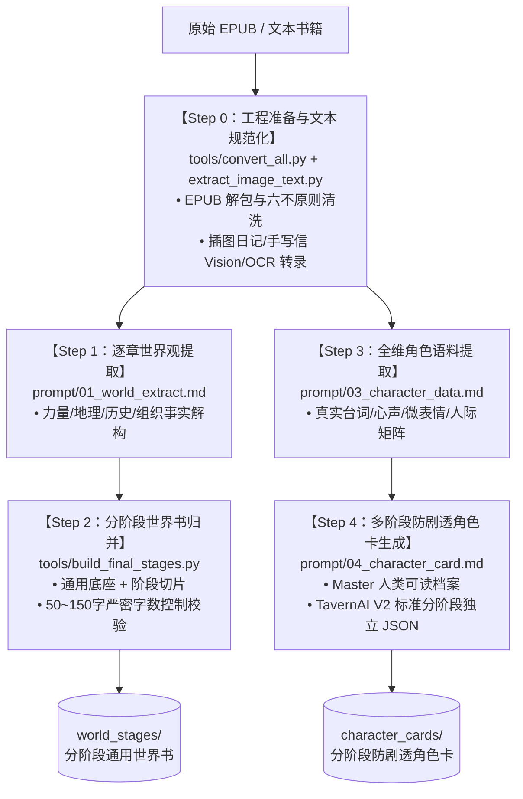
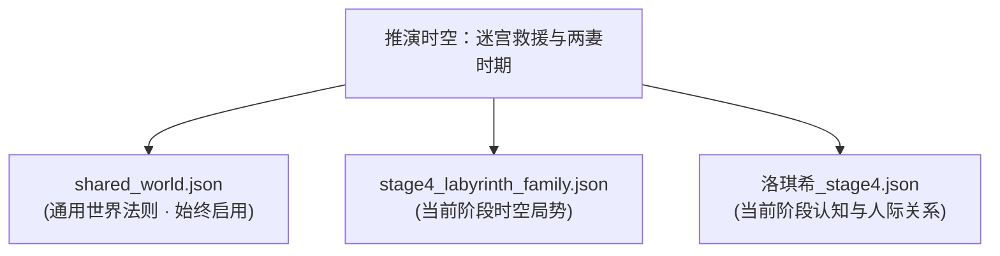

# 长篇 IP 知识工程与分阶段防剧透角色卡提取框架
# General Lorebook & Stage-Sliced Character Card Extraction Pipeline

本项目既是一套**面向长篇小说 / 宏大 ACGN 设定集的大模型角色扮演（Roleplay / RP）与推演的通用知识提取工程框架**，也是以日本轻小说《无职转生 ～到了异世界就拿出真本事～》（1~15卷，共201章）为范本打造的**工业级最佳参考实现（Gold Standard Reference Implementation）**。

> [!IMPORTANT]
> **版权合规与设计哲学**：
> 本仓库**不托管任何小说原文正文、章节切分草稿或版权电子书原文件**（`inputs/` 与 `outputs/` 目录均由 `.gitignore` 严格忽略，仅在本地流水线作业时作为瞬态数据流）。  
> 仓库核心交付物仅包含：
> 1. **通用流水线规约与模板库**（`prompt/template/`）；
> 2. **全流程自动化工具链**（`tools/`）；
> 3. **原创提炼沉淀的结构化设定字典（JSON Lorebook）与阶段切片角色卡（TavernAI V2 Character Cards）**。

---

## 一、核心痛点与框架设计哲学

在利用大语言模型（LLM）进行长篇小说与复杂世界观的 RP 或故事推演时，传统方案普遍面临两大灾难性缺陷：
1. **静态大一统单卡导致超前剧透（OOC & Timeline Pollution）**：  
   长篇小说中核心角色的**年龄、心智、肉体伤残、家庭结构、战力底牌与对幕后黑手的认知**随剧情剧变。若把全剧终的属性写进单卡，在推演早期剧情时，AI 必然发生毁灭性的预知未来与人设崩塌。
2. **世界书设定冗长、触发失控（Context Bloat & Token Waste）**：  
   未经验证的世界书往往条目冗长、充斥原文废话与主观臆测，既挤占宝贵上下文预算，又易被噪声混淆。

为此，本框架提出两大核心基石规范：
- **阶段切片架构（Stage Slicing）**：将世界观与角色状态解耦为“1 个跨阶段通用底座 + N 个历史阶段切片”，实现严格的**时空知识边界隔离**。
- **双层声纹言行协议（Dual-Layer Protocol）**：对外言行与内心独白分层建模，结合 50~150 汉字字数硬约束与高频触发词穷举，确保高保真与高触发效率。

---

## 二、通用五步知识工程流水线（The 5-Step Pipeline）

任何长篇小说、轻小说或架空世界观，均可直接套用本仓库的规约与工具链完成从生肉到可用 RP 资产的数字化全流程：



| 阶段步骤 | 核心规约与模板 | 驱动工具 | 核心产物与产出标准 |
|:---|:---|:---|:---|
| **Step 0: 数据准备** | [`prompt/template/00_tool_create_template.md`](prompt/template/00_tool_create_template.md) | [`tools/convert_all.py`](tools/convert_all.py)<br>[`tools/extract_image_text.py`](tools/extract_image_text.py) | 规范 Markdown 章节文本；插图日记与手写信 OCR/Vision 数字化还原。 |
| **Step 1: 设定提取** | [`prompt/template/01_world_extract_template.md`](prompt/template/01_world_extract_template.md) | 大模型逐章解析 | 逐章客观设定草稿，严格剥离主观臆测与剧透。 |
| **Step 2: 世界书归并** | [`prompt/template/02_world_merge_template.md`](prompt/template/02_world_merge_template.md) | [`tools/build_final_stages.py`](tools/build_final_stages.py) | `shared_world.json` + `stageN.json`；单条 50~150 汉字，关键词穷举。 |
| **Step 3: 角色语料提取** | [`prompt/template/03_character_data_template.md`](prompt/template/03_character_data_template.md) | 大模型逐章抽取 | 真实台词逐字记录、声纹与口癖、动作习惯、情绪极值与逆鳞。 |
| **Step 4: 角色卡构建** | [`prompt/template/04_character_card_template.md`](prompt/template/04_character_card_template.md) | 分阶段切片导出 | `{name}_master.md`（人类可读全维指南）与 `{name}_stageN.json`（TavernAI V2 规格）。 |

---

## 三、最佳实践参考落地案：《无职转生》资产矩阵

本项目以《无职转生》1~15 卷（幼年期至空中要塞决战龙神）为标杆，完整实施了全套资产沉淀：

### 1. 分阶段世界书体系（共 158 条，位于 [`world_stages/`](world_stages/)）
- **通用常驻底座**：[`shared_world.json`](world_stages/shared_world.json)（26 条：魔术体系、剑术与斗气、七大列强、六面世界宇宙观、吸魔石等）
- **Stage 1 幼年启蒙篇**：[`stage1_childhood.json`](world_stages/stage1_childhood.json)（16 条：卷 01~02，3~10 岁）
- **Stage 2 魔大陆长征篇**：[`stage2_demon_continent.json`](world_stages/stage2_demon_continent.json)（36 条：卷 03~06，10~13 岁）
- **Stage 3 魔法大学与早婚篇**：[`stage3_academy.json`](world_stages/stage3_academy.json)（31 条：卷 07~11，13~16 岁）
- **Stage 4 迷宫救援与两妻篇**：[`stage4_labyrinth_family.json`](world_stages/stage4_labyrinth_family.json)（24 条：卷 12~13，16~17 岁）
- **Stage 5 决战龙神与抗神篇**：[`stage5_dragon_god.json`](world_stages/stage5_dragon_god.json)（25 条：卷 14~15，17~18 岁）
- 完整条目索引见：[`world_stages/world_summary.md`](world_stages/world_summary.md)

### 2. 多阶段防剧透角色卡（位于 [`character_cards/`](character_cards/)）
已完成核心女主【洛琪希·米格路迪亚】全套交付卡：
- [`character_cards/洛琪希/洛琪希_master.md`](character_cards/洛琪希/洛琪希_master.md)：全阶段人类可读档案与 RP 指南（含双层声纹、称谓矩阵、6大经典原著 Few-Shot 样本及防 OOC 红线）。
- [`character_cards/洛琪希/洛琪希_stage1.json`](character_cards/洛琪希/洛琪希_stage1.json)：幼年家教时期（水圣级、不知大转移、挑食青椒、自省师德）。
- [`character_cards/洛琪希/洛琪希_stage2.json`](character_cards/洛琪希/洛琪希_stage2.json)：搜救队长时期（不知菲兹真相、回乡亲情和解、迷宫白马王子恋爱幻想）。
- [`character_cards/洛琪希/洛琪希_stage3.json`](character_cards/洛琪希/洛琪希_stage3.json)：迷宫深层受困时期（不知保罗阵亡与鲁迪救援、弹尽粮绝下的坚韧与绝望泪崩）。
- [`character_cards/洛琪希/洛琪希_stage4.json`](character_cards/洛琪希/洛琪希_stage4.json)：次席妻子兼大学教师时期（不知魔石病老鼠阴谋、以身救赎鲁迪心魔、融入大家庭）。
- [`character_cards/洛琪希/洛琪希_stage5.json`](character_cards/洛琪希/洛琪希_stage5.json)：大后方统帅时期（臣服龙神抗神阵营、主导接纳艾莉丝、誓守永不相忘之约）。

---

## 四、通用工具箱（Tools Ecosystem）

位于 [`tools/`](tools/) 目录下，开箱即用：

### 1. `tools/convert_all.py` —— EPUB 批量转换与清洗引擎
- 自动解析 EPUB NCX 目录与 Spine 结构；
- 执行严格的“六不原则”排版清洗（去除多余注音、格式化段落、过滤广告/版权页）；
- 支持外挂插图文字自动化回填。

### 2. `tools/extract_image_text.py` —— 通用轻小说插图转文字工具
专为解决轻小说**插图日记、手写信件、地图与人物关系图**无法被常规解析器提取的难题：
- **自动解包**：直接从 `.epub` 或本地目录扫描并批量导出高清插图；
- **图像增强管线**：灰度化、对比度增强、自动二值化去网点背景、边缘智能裁剪；
- **多引擎智能调度**：首选 **Gemini Vision 大模型引擎**（对艺术手写体、竖排繁体字、复杂底纹日记实现零错字级还原），支持本地 Tesseract 离线备用；
- **排版与繁简转换**：内置 `zhconv` 规范化为标准简体中文，支持导出为 Markdown、JSON 或 Python 数据模块。
```bash
# 从 EPUB 中提取插图并识别文字
python tools/extract_image_text.py -e "path/to/novel.epub" -o "output.md" --preprocess

# 批量识别目录中的所有手写信/插图
python tools/extract_image_text.py -d "scratch/illustrations/" -o "extracted_diary.py" --format python
```

### 3. `tools/build_final_stages.py` —— 世界书校验与构建引擎
- 自动读取设定原始表，按阶段规则生成 `stage1` ~ `stage5` 与 `shared_world.json`；
- **字数硬约束校验**：强制每个条目的 `content` 落在 **50 ~ 150 汉字** 内，超标或不足自动报警阻断，杜绝 Token 浪费。

---

## 五、在 RP 生态中的挂载规则（SillyTavern / Agent 运行规范）

推演时严禁一次性加载所有历史文件！必须遵循 **“1 个通用底座 + 1 个阶段世界书 + 1 个对应阶段角色卡”** 的三元组挂载：



- **幼年乡村生活**：加载 `shared_world` + `stage1_childhood` + `洛琪希_stage1`
- **魔大陆死胡同冒险**：加载 `shared_world` + `stage2_demon_continent` + `洛琪希_stage2`
- **魔法大学与早婚生活**：加载 `shared_world` + `stage3_academy` + `洛琪希_stage3`
- **迷宫救母与两妻家庭**：加载 `shared_world` + `stage4_labyrinth_family` + `洛琪希_stage4`
- **空中要塞与决战龙神**：加载 `shared_world` + `stage5_dragon_god` + `洛琪希_stage5`

---

## 六、快速上手与迁移至新作品

若需将本框架应用于其他作品（如《诡秘之主》、《全职高手》、《Re:从零开始的异世界生活》等）：
1. 查阅 [`prompt/template/WORKFLOW_SUMMARY.md`](prompt/template/WORKFLOW_SUMMARY.md) 获取端到端五步流水线详解；
2. 参照 [`prompt/template/`](prompt/template/) 中的标准化模板建立自己的提示词工程；
3. 使用 `tools/convert_all.py` 与 `tools/extract_image_text.py` 准备规范文本资产；
4. 运行 `tools/build_final_stages.py` 实行字数校验与世界书自动化构建。
