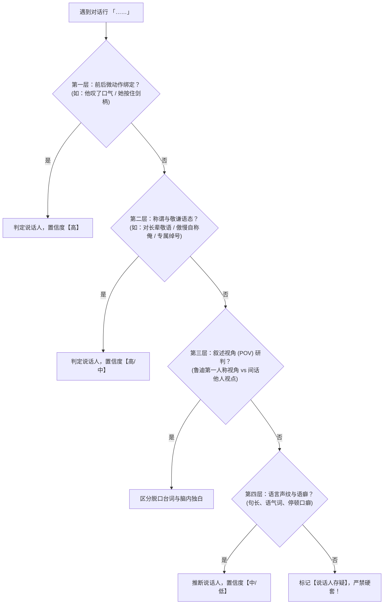

# 任务：逐章提取指定角色的全维语料与言行特征（Character Corpus Extraction）

本规约旨在从《无职转生》各卷章节原文中，系统、高精度地提取目标角色的**真实台词（逐字原话）、表里言行（内外心声分离）、微动作习惯、人际交互与情绪反应**，为下游生成高保真、零幻觉、防剧透的角色人格卡（Character Card）提供 100% 忠于原著的数据地基。

---

## 一、角色参数配置区（执行前指定）

每次执行提取任务前，在此处指定目标角色参数（支持任意角色，如：鲁迪乌斯、艾莉丝、洛琪希、希露菲、保罗、奥尔斯蒂德、七星等）：

```yaml
目标角色设定:
  标准姓名: "【鲁迪乌斯·格雷拉特】"
  常见简称/别名: ["鲁迪", "泥沼", "Dead End的饲主", "龙头老大", "龙神的右腕", "魔导王", "大魔导师", "无咏唱魔术师"]
  他人专属称呼:
    艾莉丝: ["鲁迪", "笨蛋鲁迪"]
    洛琪希: ["鲁迪乌斯", "鲁迪乌斯先生", "弟子"]
    希露菲: ["鲁迪", "鲁迪乌斯"]
    保罗: ["鲁迪", "臭小子", "笨蛋儿子"]
    七星: ["格雷拉特", "鲁迪"]
    奥尔斯蒂德: ["鲁迪乌斯"]
  角色主观特征: "前世34岁家里蹲尼特，外表谦卑客气/甚至低声下气，内心腹黑猥琐/冷静吐糟/伴随重度心理阴影"
```

---

## 二、输入与输出流

- **输入目录**：`outputs/chapters/{volume_id}/{chapter_id}.md`（如 `outputs/chapters/01/01_第一话.md`）
- **输出目录**：`outputs/char_raw/{character_name}/{volume_id}/{chapter_id}.md`
- **关联参考**：`world_stages/shared_world.json` 与对应阶段世界书（用于核对角色当时身份背景）

---

## 三、执行模式与批处理策略

1. **分卷独立执行**：
   - 严禁一次性将多卷文本灌入同一上下文。
   - 每次处理以**一整卷（约 10~18 章）**为单位，逐卷循环推进，保障提取质量与细节饱和度。
2. **子代理并行提取**：
   - 当单卷章节数超过 10 章时，可派发并发子代理按章并行提取，最后统一按章节序汇总质检。
3. **输出命名对齐**：
   - 提取结果的文件名必须与原始章节完全一致（例如 `01_第一话_「家庭教师到来」.md`）。

---

## 四、核心难点：轻小说无说话人标注判别协议（5层穿透法）

日系轻小说中对话普遍省略说话人主语，必须按以下 5 层递进逻辑严密研判：



### 1. 第一层：动作与视线锚定（Action & Gaze Anchoring）
- 紧接台词前后的微动作通常与说话者绑定（例如：“我挠了挠后颈”、“她狠狠地跺了一下脚”）。
- 注意陷阱：若前一句是听者的反应（“听到这话，艾莉丝瞪圆了眼睛”），随后的台词往往属于**说话者**而非听者。

### 2. 第二层：称谓与敬语阶层（Honorific & Address Level）
- 观察台词中的自称与尊称：
  - 自称：`我`（普通）、`在下 / 小生`（鲁迪外在谦逊/滑稽）、`老子 / 本小姐`（艾莉丝暴躁）。
  - 称谓：叫“师尊（师匠）”必为鲁迪对洛琪希；叫“鲁迪乌斯大人”通常为下仆或崇拜者；叫“大小姐”多为基列奴或管家。

### 3. 第三层：叙述视角（POV）判别与表里分离（极为关键！）
- **主视角章节（鲁迪视点）**：
  - **实际脱口而出的台词**（双引号/直角引号 `「……」`）：鲁迪对外表现，多为周到、卑微、客气、谨慎。
  - **脑内真实吐槽与心理独白**（括号 `（……）` 或无引号叙述文本）：前世尼特大叔的真实想法，包含好色、猥琐、恐惧、前世创伤回忆。
  - **绝对红线**：**严禁将脑内独白当作外部台词提取！必须严格分流记录！**
- **视角转换章节（间话 / 特稿 / 他人视点）**：
  - 如《保罗视点》《艾莉丝视点》《狂犬收起剑鞘》等，文中的“我”为**该章节的主视角角色**，目标角色（若非该主角）会以第三人称（“他”、“那个小鬼”、“鲁迪乌斯”）出现，切勿搞混人称！

### 4. 第四层：语癖与句式节奏（Voiceprint Markers）
- 鲁迪：语速平缓，解释型长句多，常带自嘲或半开玩笑的敬语，紧张时会连用确认语气。
- 艾莉丝：短句居多，多用感叹号，语速极快，情绪直白，少有弯弯绕绕。
- 洛琪希：语气平稳清冷，带有学者与教师的条理感，遇到尴尬或被戳中心事时会产生结巴或微弱反驳。

### 5. 第五层：存疑兜底机制
- 若语境模糊且缺乏明确线索，标注 `[说话人存疑: 候选为A或B]`，并记录判断依据，**绝不允许为了“完整”而脑补**。

---

## 五、语料提取的六大核心维度

针对每一章节，必须全面穿透以下六个维度：

1. **情境与时间线锚定**：
   - 记录当前卷号、章节号、所属世界书阶段（`stage1_childhood` ~ `stage5_dragon_god`）。
   - 记录场景地点与所有同场互动角色。
2. **真实台词原声库（Verbatim Dialogue）**：
   - 逐字完整收录，保留一切语气词（“啊、呃、呜、哈”）、省略号、破折号与结巴感。
   - 附带发言时的情绪状态（平静、恐惧、谄媚、冷酷、愤怒、撒娇）。
3. **表里分层：脑内心声与潜台词（Inner Monologue & Subtext）**：
   - 记录该角色“嘴上说的”与“心里想的”之间的反差与矛盾。
   - 记录面临抉择时的心理博弈与恐惧根源。
4. **身体语言与微习惯（Micro-actions & Habits）**：
   - 习惯性动作（如：鲁迪摸鼻子、向后退半步、双手下垂行礼；艾莉丝抱胸挺胸、踢石子、握住剑柄）。
   - 战斗准备动作与生理反应（心跳加速、冷汗、反胃、手颤）。
5. **人际网络称谓与交互动态（Relational Matrix）**：
   - 记录该角色本章对其他人的**具体称呼**与**态度表现**。
   - 记录其他人对该角色的**具体称呼**、**言语评价**与**眼神态度**。
6. **情绪极值与逆鳞触发（Emotional Triggers）**：
   - 记录导致角色破防、极度悲伤、下跪道歉或爆发杀意的触发事件。

---

## 六、标准输出格式模板（每个章节文件内容）

提取出的 Markdown 文件必须严格套用以下模版：

```markdown
# [卷02_第05话] 【鲁迪乌斯·格雷拉特】全维语料提取

## 一、基本情境与出场定位
- 对应阶段：stage1_childhood (幼年篇 · 罗亚时期)
- 是否出场：是
- 场景地点：伯雷亚斯宅邸·书房
- 同场角色：艾莉丝、基列奴、菲利普
- 出场概括：鲁迪教导艾莉丝算术与魔术，遭遇艾莉丝的暴力抗拒并以心理策略化解。

## 二、真实台词精录（逐字原声）
1. 「大小姐，请冷静一点。如果现在放弃的话，明天的点心时间可就要变成冥想修行了哦。」
   - 语境对象：对艾莉丝
   - 表层语气：温和、半开玩笑、带着家庭教师的哄劝
   - 判定依据：紧接着动作描写“我微笑着合上手中的教材”。
   - 置信度：【高】
2. 「基列奴小姐，刚才艾莉丝挥剑的角度，重心似乎稍微靠前了半寸对吧？」
   - 语境对象：对基列奴
   - 表层语气：谦逊求教、严谨
   - 判定依据：后文基列奴回答“唔，确实如此”。
   - 置信度：【高】

## 三、表里分层（外在言行 vs 脑内心声）
- 外在表现：低头躬身，毕恭毕敬地承受艾莉丝的踢击。
- 脑内独白（内心真实想法）：
  > “好痛！这小母狗下手真狠啊……不过忍耐是值得的。前世因为一点挫折就当了三十年家里蹲废人，这次哪怕被揍得鼻青脸肿，也绝对不能再逃避了！”
- 潜台词与心理反差：用前世毁灭的惨痛教训强迫自己咽下自尊心，把痛楚当成自我赎罪的洗礼。

## 四、行为动作与微习惯
- 微动作描写：“我下意识地用食指挠了挠鼻尖，视线微微向下移开半寸。”（反映其心虚或掩饰真实意图时的潜意识习惯）
- 战斗/危机反应：“右掌立刻暗中在袖袍内凝聚微型泥弹，随时准备瞬发阻滞对手。”

## 五、人际网络交互切片
- 对【艾莉丝】：称呼为「艾莉丝大小姐」；态度为“表面纵容退让，暗中设下规矩底线，绝不正面硬碰”。
- 对【基列奴】：称呼为「基列奴小姐 / 师尊」；态度为“由衷敬佩其剑术直觉，视作绝对武力后盾”。
- 他人对该角色的评价：
  - 菲利普 → 对鲁迪评价：“……这孩子有着远超同龄人的阴险与圆滑，真不像是保罗那种直肠子能生出来的。”（原文第 42 段）

## 六、情绪极值与逆鳞
- 情绪状态：轻度受挫后迅速自我重组。
- 触发逆鳞：未触发（本章无侮辱家人或剥夺其生存权利的事件）。

## 七、疑难与特殊标注
- [第 28 段台词] 「吵死了，那种事情怎样都好！」
  - 存疑说明：前文未写动作，紧接艾莉丝哼声，推断 90% 概率为艾莉丝所说，未归入鲁迪语料。
```

---

## 七、质检红线与防错准则

1. **绝对字面原则**：台词部分必须 100% 逐字摘录，不得修正语法、不得润色用词，保持原著韵味。
2. **严禁混淆视听**：把心里想的错当成嘴上说的，是生成角色卡时最致命的错误。心声必须放在“表里分层”，台词必须放在“真实台词”。
3. **未出场处理**：若该角色本章完全未登场、未被提及，简要输出：
   ```markdown
   # [卷XX_第XX话] 【角色名】全维语料提取
   - 本章出场情况：完全未登场，亦未被直接提及。
   ```
4. **阶段纯度保障**：只记录本章呈现出的当期状态，不拿后期的剧情、后期的觉悟来倒推前期的角色表现。