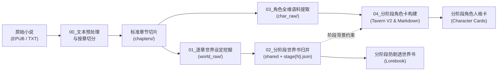

# 通用 IP 知识工程与分阶段角色卡提示词流水线模板（Prompt Templates）

本目录提供了从**长篇小说/轻小说原始文本（EPUB / TXT）**出发，全自动或半自动构建**面向大语言模型（LLM）的角色扮演（RP）、推演代理（Agent）与知识问答的高保真、分阶段防剧透世界书与角色卡**的完整通用模板库。

无论是《无职转生》、《诡秘之主》、《Re:从零开始的异世界生活》、《火影忍者》还是《全职猎人》，均可直接套用本套流水线模板一键实例化。

---

## 一、五步端到端流水线（00 ~ 04）

---

## 二、模板清单与功能索引

| 模板文件 | 阶段定位 | 核心任务 | 输出目标 | 适用场景 |
|:---|:---:|:---|:---|:---|
| [`00_tool_create_template.md`](00_tool_create_template.md) | **预处理** | 电子书按 Spine/目录解析，智能过滤插图/扉页，清洗注音与无意义换行 | `chapters/{vol}/{ch}.md` | 任何电子书批量标准化切章 |
| [`01_world_extract_template.md`](01_world_extract_template.md) | **设定挖掘** | 逐章提取地理、势力、力量体系、物品等，严密剥离“角色主观认知”与“客观事实” | `world_raw/{vol}/{ch}.md` | 逐章无脑补事实抽取 |
| [`02_world_merge_template.md`](02_world_merge_template.md) | **世界书聚合** | 实施时间线阶段切片，严格执行 50~150 汉字硬指标，双条目防剧透隔离 | `world_stages/*.json` | 构建专业级分阶段 Lorebook |
| [`03_character_data_template.md`](03_character_data_template.md) | **语料挖掘** | 5层穿透无标注说话人识别，表里言行分离（实际台词 vs 脑内心声），动作与关系切片 | `char_raw/{char}/*.md` | 任何角色的原声台词挖掘 |
| [`04_character_card_template.md`](04_character_card_template.md) | **角色卡生成** | 摒弃静态单卡，建立分阶段状态矩阵，多轮 `<START>` Few-Shot，兼容 Tavern V2 | `character_cards/*.json` | 导出可直接在酒馆/Agent 使用的角色卡 |
| [`WORKFLOW_SUMMARY.md`](WORKFLOW_SUMMARY.md) | **全景指南** | 深度解析五步工作流的设计哲学、防剧透防 OOC 原则、版权安全与质检法则 | 知识工程规范 | 团队协同与开发指南 |

---

## 三、快速开始：如何为新作品立项？

1. **复制模板**：
   将 `prompt/template/` 中的 5 个模板复制到你的新项目 `prompt/` 目录下。
2. **替换全局占位变量**：
   批量搜索并替换以下大括号变量：
   - `{{PROJECT_NAME}}`：项目名称（如《诡秘之主》）
   - `{{AUTHOR_NAME}}`：作者原名（如爱潜水的乌贼）
   - `{{TOTAL_VOLUMES}}`：总卷数或总章节数
   - `{{STAGE_DEFINITIONS}}`：根据原著时间线划分的 3~6 个历史阶段（如序列9时期、贝克兰德时期、廷根时期等）
   - `{{TARGET_CHARACTER}}`：目标提取角色姓名与核心别名表
3. **顺序执行流水线**：
   按照 `00 -> 01 -> 02` 生成分阶段世界书，随后按照 `03 -> 04` 生成该角色的分阶段人格卡。
